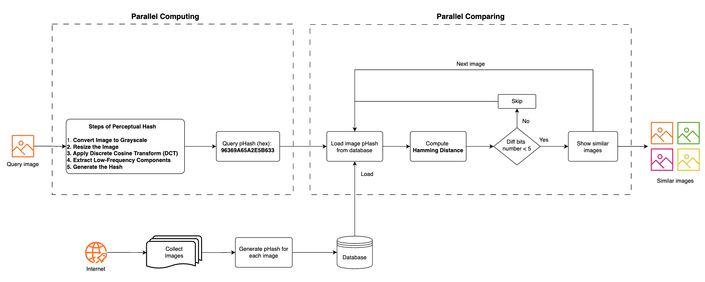

# NYCU Parallel Programming Final Project
# Image Retrieval Based on Perceptual Hashing and CUDA
This project aims to design a content-based image retrieval (CBIR) system using **Perceptual Hash** to efficiently identify visually similar images. By extracting compact hash representations, the system enables fast ***search by image*** functionality in large-scale datasets. 

To address performance bottlenecks, parallel computing techniques are employed: **NVIDA CUDA** for GPU acceleration, and **OpenMP** for CPU multi-core parallelism have been included. These methods are applied to both hash generation and comparison phases to improve efficiency. The system seeks to deliver real-time image similarity retrieval with enhanced scalability and performance through the integration of perceptual hashing and high-performance parallelization.

### Contributions
- A command-line utility to generate Perceptual Hash values for thousands of images in a public dataset
- A graphical interface to compare images using **Hamming distance**

## System Workflow

## Subprojects
### 📊 [pHash_Serial_OpenMP_GCC_O3](./pHash_Generation_Serial_OpenMP_GCC_O3/)
A command-line tool to generate pHash values for images using serial and OpenMP implementations, with GCC `-O3` optimization.

Features:
- Serial version with GCC `-O3` optimization
- OpenMP acceleration GCC `-O3` optimization
- Elapsed time for each method
- Generated pHash values for all images in the dataset

### 🚀 [pHash_OpenCV](./pHash_OpenCV/)
A command-line tool to generate pHash values for images implemented by OpenCV library.

Features:
- OpenCV acceleration with the **best performance** compared with OpenMP and CUDA

### 📈 [pHash_CUDA](./pHash_CUDA/)
A command-line tool to generate pHash values for images implemented by three CUDA versions.

Features:
- Implemented CUDA optimization for DCT2D calculation
- Enhanced performance with Grayscale, Resize, DCT (row-wise and column-wise), and block extraction optimization
- Enabled asynchronous and parallel execution with CUDA Steam
- Elapsed time for each method
- Generate pHash values for all images in the dataset

### 🖼️ [pHash_Comparision_QT](./pHash_Comparison_QT/)
A Qt-based GUI application to the SQLite database and search for similar images using perceptual hashes and multiple comparison methods.

Features:
- Load the SQLite database
- GUI for image import/search
- Supported Sequential, OpenMP and PThread comparison
- Python OpenCV support for pHash

## Dataset Recommendation

- [UKBench dataset](https://www.kaggle.com/datasets/sunghoshim/ukbench100)

## License

This repository is intended for academic and educational use. Please cite if used in research or coursework.
